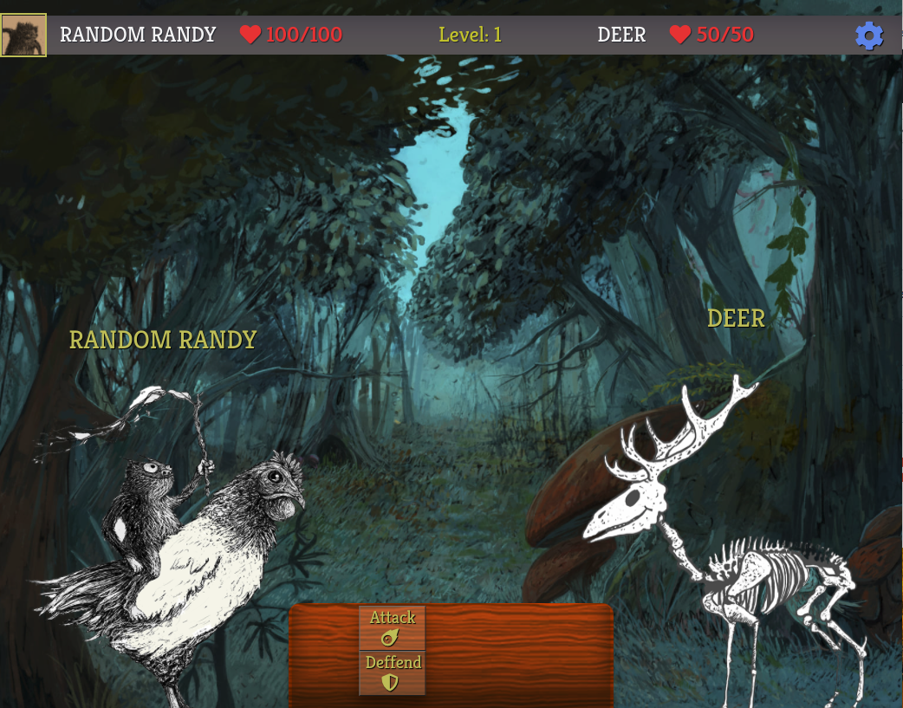
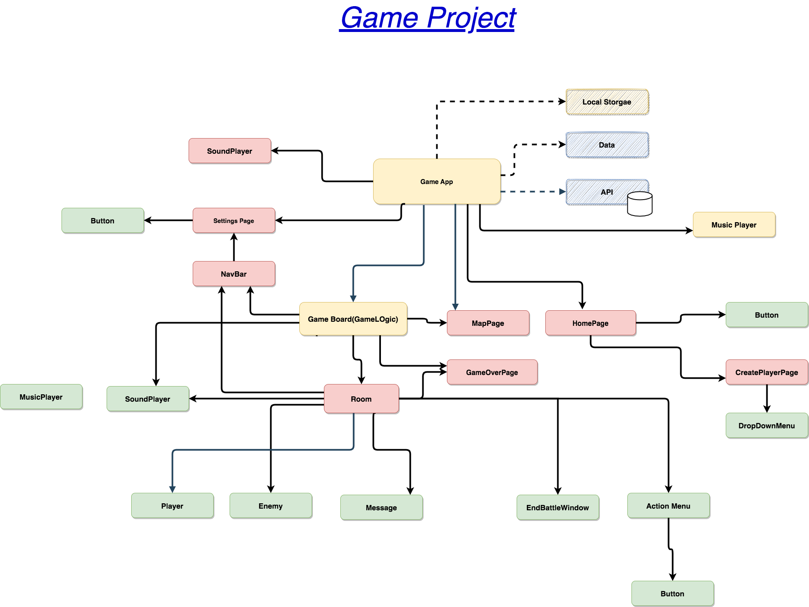
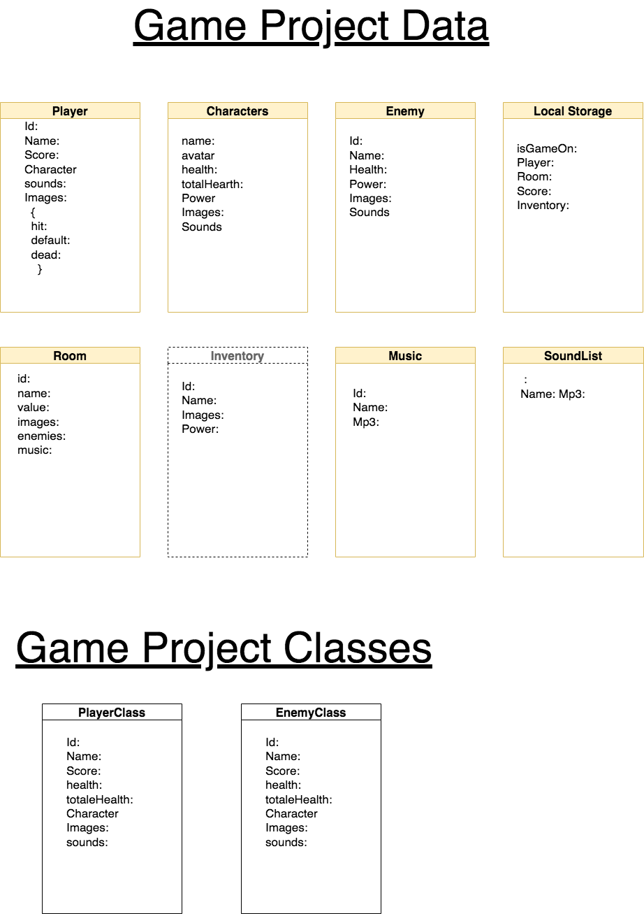

[comment]: <> (# Mid-Project)

 

# The Chicken Runner

## A game created with React

-  <a href="https://mid-project-game-dk.netlify.app/"><strong> The Game On Netlify </strong></a>

### About the Project 

- This project was a week assigment- part of  the **AppleSeed- BootCamp -2021**
- I wanted to learn to use animations with react, so I decided to make a game.
- There is an API (MockApi) that can store and Load Player.
- The current player is stored in the local storage
- I used art and drawings from the artist: [Alon-Gaash](https://alon-site.herokuapp.com//)

## Built with  :
- * [React.js](https://reactjs.org/)
- * [React-Spring](https://react-spring.io/)
- * [MockAPi](https://mockapi.io/)
 

# Links:

-  <a href="https://github.com/dankarger/mid-project-game"><strong> Dan Karger- GitHub </strong></a>
-  <a href="https://alon-site.herokuapp.com/"><strong> Alon Gaash- Artist </strong></a>
-  <a href="https://mid-project-game-dk.netlify.app/"><strong> The Game On Netlify </strong></a>
